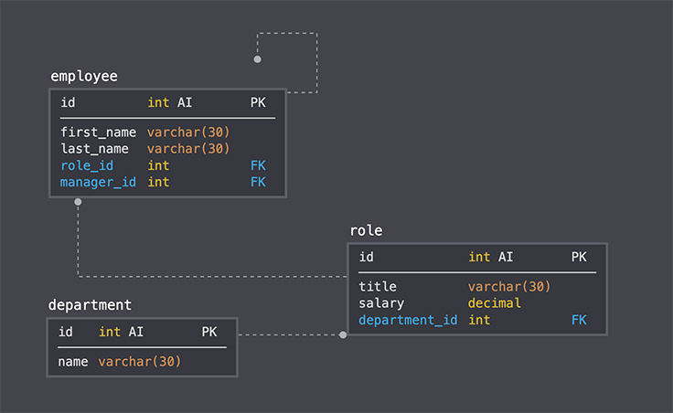
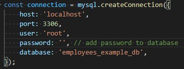
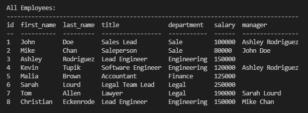

# Employees Tracker

## Description
This application developed for viewing and interacting with information stored in databases. It designed for managing a company's employees throughthout terminal. The application allows view and add information about employees and store it in database.

## Installation
To be able to use the application you need to install the necessary `npm modules`. You can do this by running the command 

```bash
npm install
```

in the root folder of the project.

The application used MySQL database. You can found a [schema.sql](./db/schema.sql) file in project folder for database example.



You should add configuration data about your database connection in [connection.js](./config/connection.js) config file:



## Usage
To run application use this command from root folder:

```bash
npm start
```

the application asks the user what action he wants to take.

List of available actions:

1. View All Employees
2. View All Employees By Roles
3. View All Employees By Departments
4. Add Employee
5. Add Role
6. Add Department
7. Update employee role
8. Exit App

The user can view the data or enter new ones, depending on the selected action.

Example of app uotput data:



Watch a [Video Guide](https://drive.google.com/file/d/1Yk_Gpirhxvp5gvsdYuuuntRCd6CjygYt/view) for more detailed example of application workflow.

## Credits
Author [Oleksandr Kulyk](https://github.com/AlexKuWerz)

Packages used:
- [MySQL](https://www.npmjs.com/package/mysql)
- [Inquirer](https://www.npmjs.com/package/inquirer)
- [console.table](https://www.npmjs.com/package/console.table)